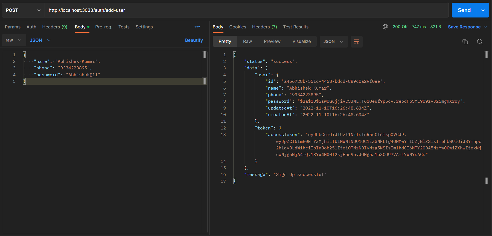
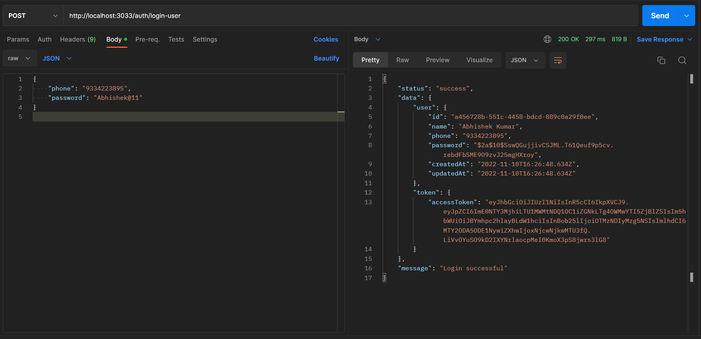
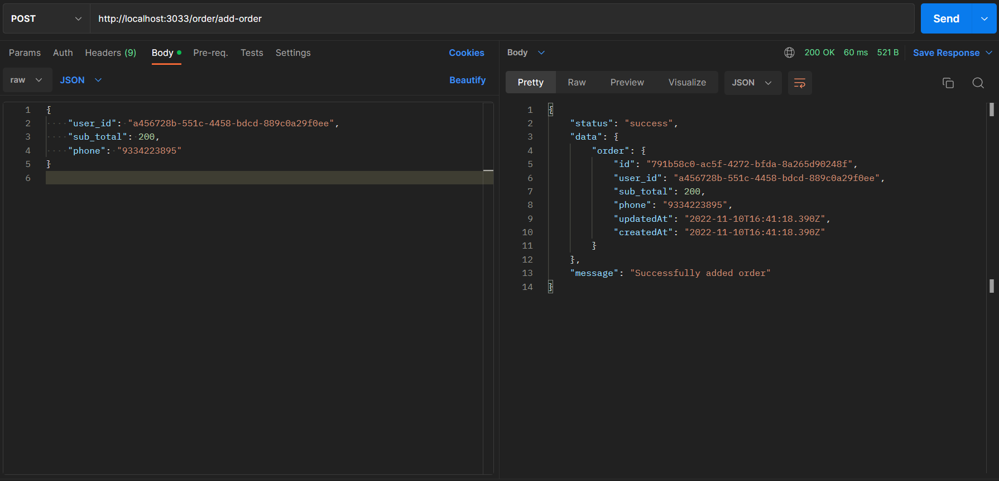
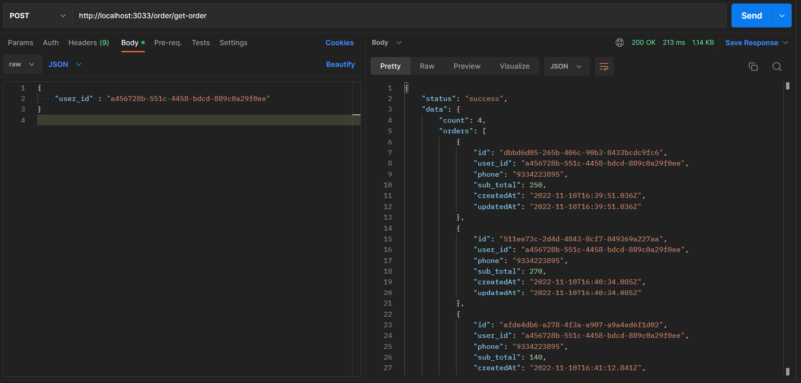

# Ordering-App

### Technologies and Tools Used :
* Node.js
* Express.js
* PostrgeSQL
* VS code
* Postman
* Git

### Packages Used :
* Nodemon
* sequelize
* jsonwebtoken
* bcrypt (hashing)
* uuid

## POSTMAN RECORDS FOR THE APIs

### Create User API
|  | 
| ---------------------------------------------- | 

### Login User API
|  | 
| ---------------------------------------------- | 

### Create Order API
|  | 
| ---------------------------------------------- | 

### View Orders API
|  | 
| ---------------------------------------------- | 
